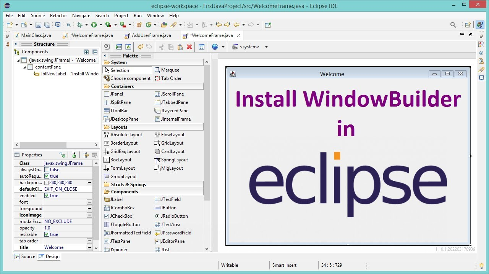

[toc]

# 빈에 대한 것


## 자바빈(JavaBean)

> 자바빈(JavaBean) 이란?
>
> * 디폴트 생성자: 자바빈은 파라미터가 없는 디폴트 생성자를 갖고 있어야한다.
>   툴이나 프레임워크에서 리플렉션을 이용해 오브젝트를 생성하기 때문에 필요하다.
>   * 요즘은 컴파일러가 디폴트 생성자를 자동으로 생성한다. 단, 클래스에 다른 생성자를 하나라도 직접 선언하면 컴파일러가 디폴트 생성자를 자동으로 생성하지 않는다. 또는 스프링부트의 어노테이션을 활용하여 자동으로 디폴트 생성자 생성이 가능하다. 
> * 프로퍼티 : 자바빈이 노출하는 이름을 가진 속성을 프로퍼티라고 한다. 프로퍼티는 set으로 시작하는 수정자 메소드(setter)와 get으로 시작하는 접근자 메소드(getter)를 이용해 수정 또는 조회 할 수 있다.
>
> **자바빈 개념 관례**
>
> * private로 데이터를 저장하는 멤버 변수를 가진다.
> * 멤버 변수에 대해 public getter/setter 메소드를 가진다.
> * 인자 없는 public 기본 생성자를 가진다.
> * 자바빈은 기본 패키지가 아닌 특정한 패키지에 속해야 한다.
> * 선택) 직렬화 가능하게  Serializable를 상속 받는다.
>
> 
>
> **모든 자바빈은 POJO지만, 모든 POJO가 자바빈은 아니다(ex: 생성자, getter/setter가 없는 POJO)**
>
> 자바빈은 특정 규칙(규약)을 따르는 POJO이다. 
>
> [POJO란](./study/POJO란.md)


## 비주얼 자바빈(Visual JavaBeans)

> **비주얼 자바빈이란?**
>
> GUI 빌더(비주얼 툴 ex : NetBeans GUI Builder, Eclipse WindowBuilder)에서 UI 컴포넌트를 끌어다 놓고 속성창에서 값을 바꾸고, 이벤트 연결까지 할 수 있도록 만든 재사용 가능한 UI 컴포넌트를 뜻한다.
>
> 또한 비주얼 자바빈의 개념은 Swing/AWT GUI와 관련되어서 사용하는 개념이었다.
> 자바시장에서 Swing/AWT GUI를 활용한 프로그램 개발 시장이 작아지게 되면서, 흔히 사람들이 이야기하는 자바빈의 이야기는 비주얼 자바빈이 아닌 자바빈(JavaBean)을 흔히 지칭하게 되었다.
>
> 또한 비주얼 자바빈의 개념관례에는 위에서 언급한 자바빈의 관례를 포함한다.
> 즉 프로퍼티 규칙을 지키고 디폴트 생성자가 존재한다는 뜻이다.
>
> 
>
> **주의점**
>
> 안드로이드 스튜디오에서 버튼을 드래그해서 배치하는건 비주얼 툴 이라는 관점에서는 비슷하지만, 해당 컴포넌트 ui를 비주얼 자바빈 이라고 부르진 않는다.
>
> 자바빈(Visual JavaBeans)은 Java SE의 javaBeans 규약과 Swing/AWT같은 데스크톱 컴포넌트를 전제로한 개념인데.
> 안드로이드는 자체 UI 프레임워크(View, AttributeSet,XML 레이아웃, R.java, 리소스 시스템 등)를 갖고 있고,  
> JavaBeans의 프로퍼티 규약(get/set)이나 BeanInfo로 디자이너 속성창이 구성되는 구조가 아니다.
>
> 
>
> * NetBeans GUI Builder 이미지 
>
> 
>
> * Eclipse WindowBuilder 이미지 
>
> 
>
> 예시코드
>
>
> ```java
> import javax.swing.*;
> import java.awt.*;
> import java.beans.PropertyChangeListener;
> import java.beans.PropertyChangeSupport;
> 
> public class StatusBadge extends JComponent {
>     private String text = "READY";
>     private final PropertyChangeSupport pcs = new PropertyChangeSupport(this);
> 
>     //디폴트 생성자
>     public StatusBadge() {}
> 
>     //프로퍼티 (GUI 빌더가 속성으로 인식)
>     public String getText() { return text; }
> 
>     public void setText(String text) {
>         String old = this.text;
>         this.text = text;
>         pcs.firePropertyChange("text", old, text); // (선택) Bound property
>         repaint(); // 화면 다시 그리기
>     }
> 
>     //프로퍼티 변경 리스너
>     public void addPropertyChangeListener(PropertyChangeListener l) {
>         pcs.addPropertyChangeListener(l);
>     }
>     public void removePropertyChangeListener(PropertyChangeListener l) {
>         pcs.removePropertyChangeListener(l);
>     }
> 
>     @Override
>     protected void paintComponent(Graphics g) {
>         super.paintComponent(g);
>         g.drawString(text, 10, 20);
>     }
> 
>     @Override
>     public Dimension getPreferredSize() {
>         return new Dimension(120, 30);
>     }
> }
> 
> ```
>
> 
>
> 


## 정리

* 자바빈은 원래 **시각적 개발 도구(비주얼 툴)에서 드래그 앤 드롭 등으로 조작할 수 있도록 만들어진 재사용 가능한 자바 컴포넌트**를 의미
* awt와 swing을 잘 안쓰게 되면서 웹 개발 환경에서 **데이터를 담는 단순한 자바 클래스(POJO, Plain Old Java Object)**를 지칭하게 됨
* 오늘날의 자바빈의 관례는 비주얼 자바빈에서 사용하는 관례를 가져온 것.
* 두 개를 구분 짓기위해 **비주얼 자바빈** 과 **자바빈(POJO)**로 표현 한 것.


## 스프링 빈

> Spring Bean 이란?

